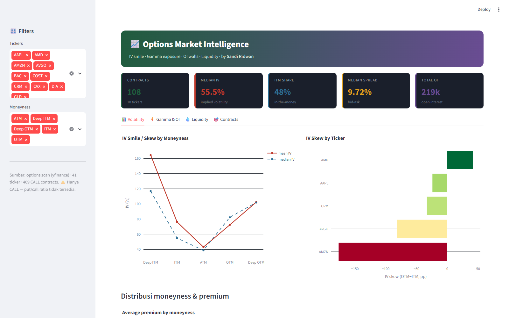
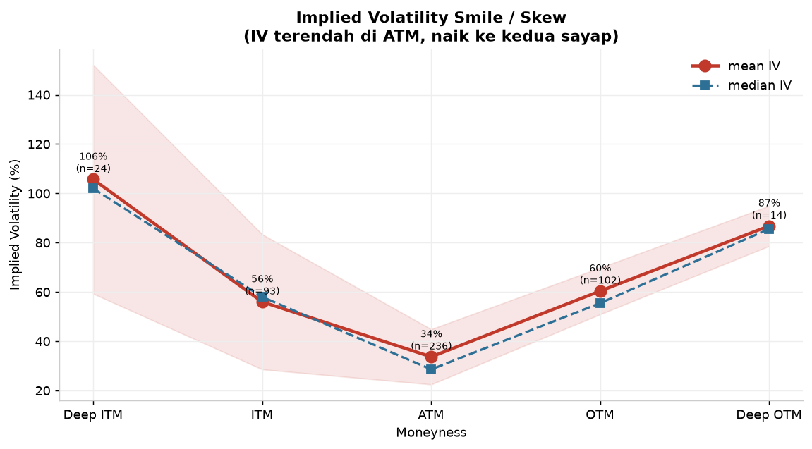
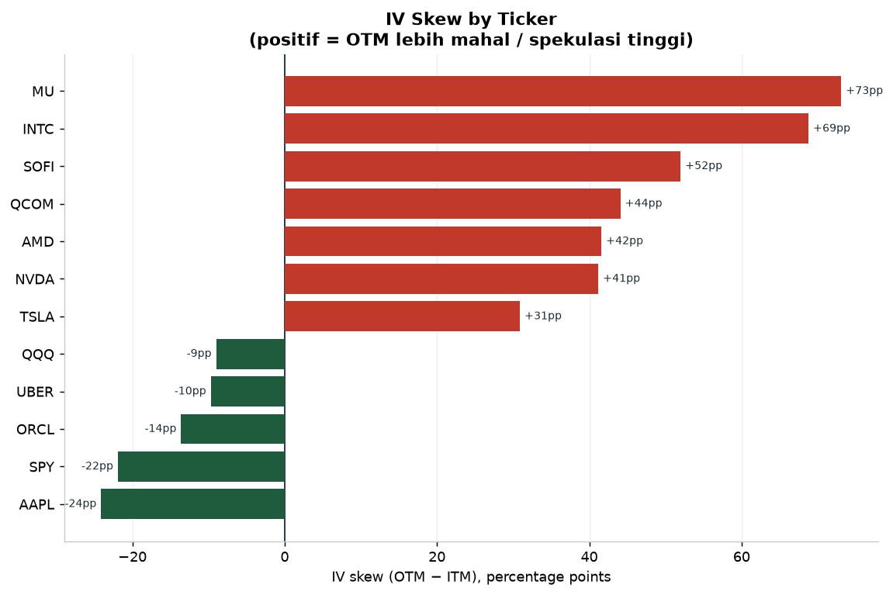
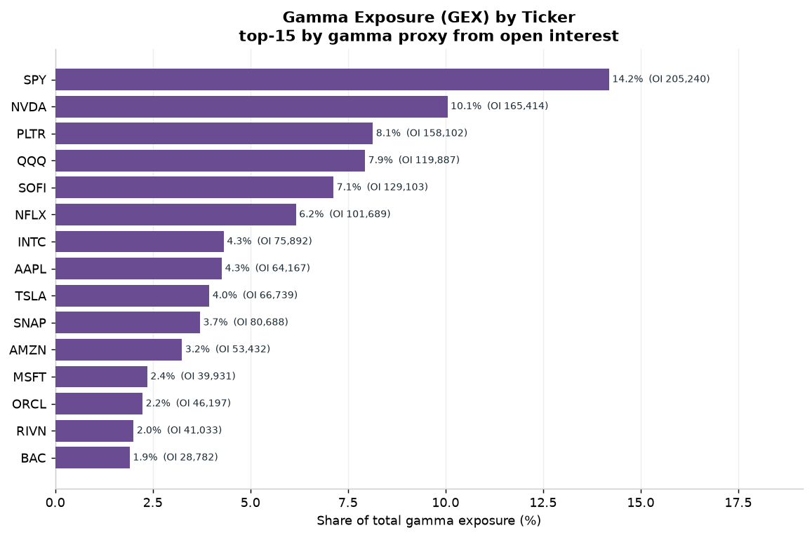
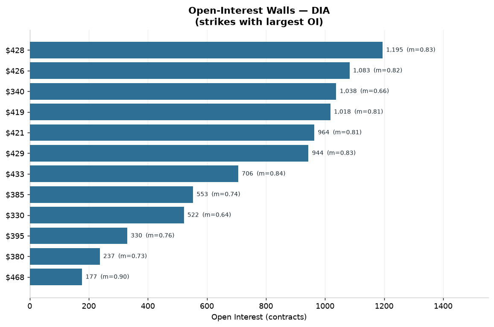
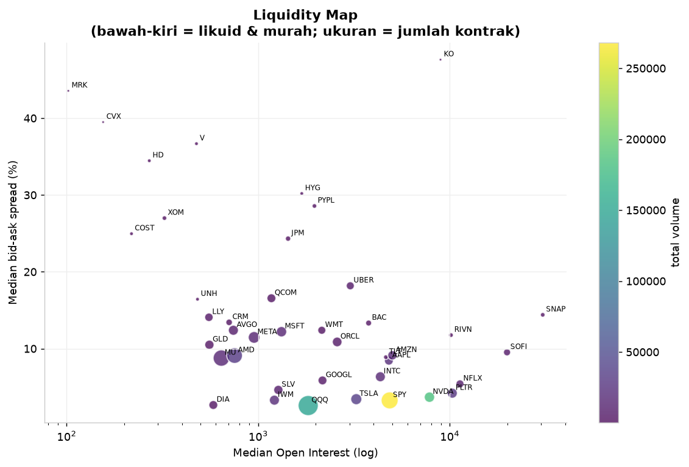
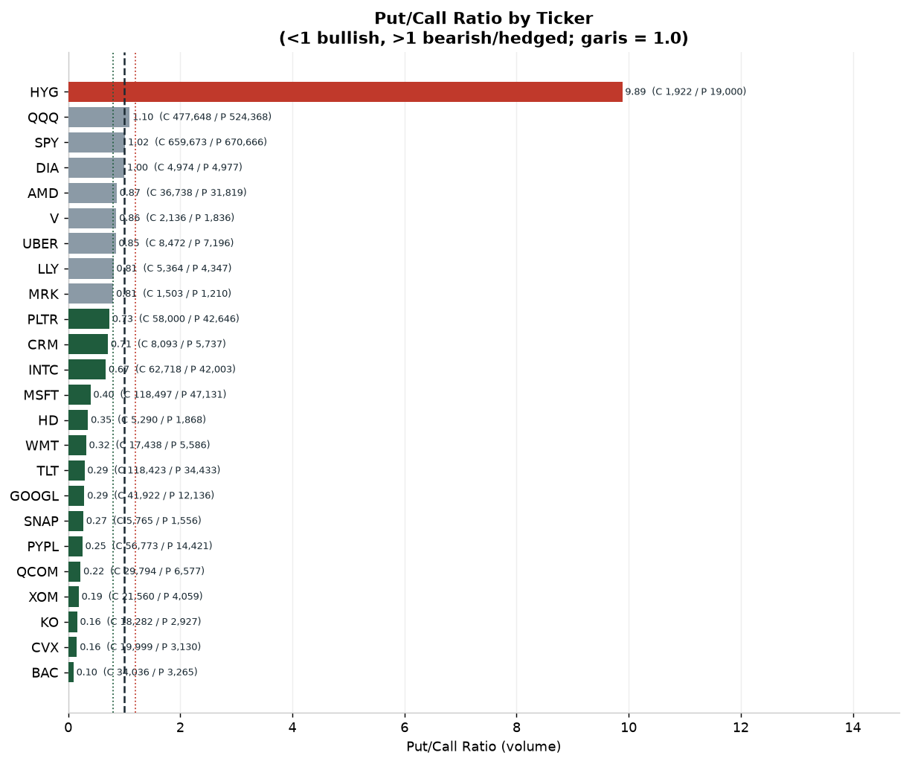
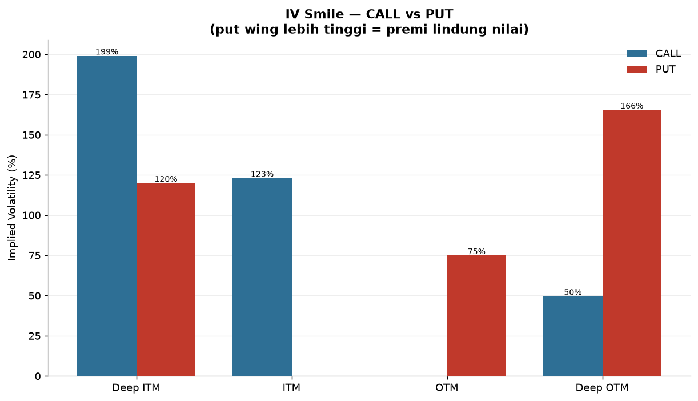
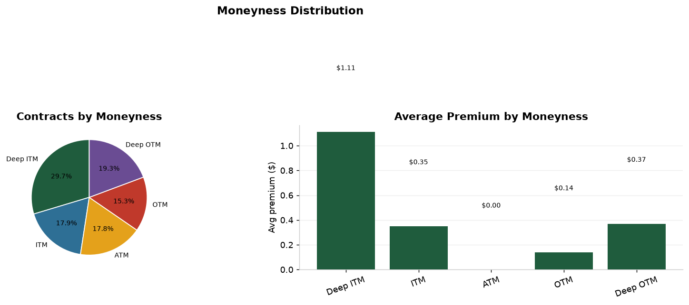
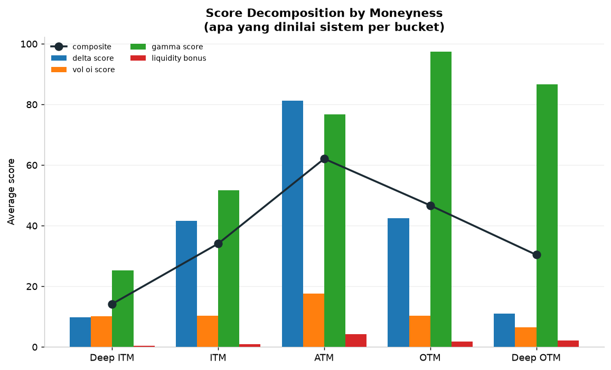

<div align="center">


<br/>


</div>

---

```
╔══════════════════════════════════════════════════════════════════════════╗
║                                                                          ║
║   ██████╗ ██████╗ ████████╗██╗ ██████╗ ███╗   ██╗███████╗               ║
║  ██╔═══██╗██╔══██╗╚══██╔══╝██║██╔═══██╗████╗  ██║██╔════╝               ║
║  ██║   ██║██████╔╝   ██║   ██║██║   ██║██╔██╗ ██║███████╗               ║
║  ██║   ██║██╔═══╝    ██║   ██║██║   ██║██║╚██╗██║╚════██║               ║
║  ╚██████╔╝██║        ██║   ██║╚██████╔╝██║ ╚████║███████║               ║
║   ╚═════╝ ╚═╝        ╚═╝   ╚═╝ ╚═════╝ ╚═╝  ╚═══╝╚══════╝               ║
║                                                                          ║
║   MARKET INTELLIGENCE · IV SMILE · GEX · OI WALLS · LIQUIDITY           ║
╚══════════════════════════════════════════════════════════════════════════╝
```

---

## 🎬 Demo

<div align="center">
  
  <br/>
  <sub><i>Interactive Streamlit dashboard — IV smile, IV skew, GEX, liquidity, contract scores</i></sub>
</div>

<br/>

```bash
streamlit run app/dashboard.py     # → http://localhost:8504
```

---

## 🧠 Overview

**Options Market Intelligence** mengubah **daftar kontrak opsi** menjadi **intelijen
pasar**: apa yang dikatakan permintaan opsi tentang ekspektasi pasar, volatilitas,
dan level kunci. Berbeda dari sebuah *scanner* (yang memilih kontrak), proyek ini
adalah **lapisan analis** — mengukur struktur pasar opsi secara menyeluruh.

<div align="center">

| Metric | Value |
|-------:|:------|
| 📊 Sumber | **yfinance** — 41 ticker · CALL + PUT lengkap |
| 🧾 Kontrak | **4.855 = 2.448 CALL + 2.407 PUT** (lengkap!) |
| 📈 Put/Call Ratio | **0.50** (volume) — sentimen bullish |
| 💧 Median spread | **7,9%** (bid-ask) |
| 🗂️ Total volume | 5,3 juta kontrak |
| 📁 Output | Streamlit app · 10 charts · tabel insight |

</div>

> ✅ **Dataset kini CALL + PUT lengkap** (dikumpulkan via yfinance) — sehingga
> **Put/Call Ratio** dapat dihitung.
>
> ⚠️ **Catatan jujur:** `openInterest` dari Yahoo hampir selalu 0 untuk kuotasi
> realtime, sehingga **PCR berbasis volume** (bukan OI). Bila OI kosong, laporan
> mengatakannya — bukan memaksakan metrik.

---

## ⚡ Analisis Inti

### 1. Implied Volatility Smile / Skew



**Temuan:** IV membentuk **pola U** klasik — terendah di **ATM (34%)**, naik ke
**Deep ITM (106%)** dan **Deep OTM (87%)**. Ini adalah *volatility smile*: pasar
memberi premi lebih besar untuk strike ekstrem (deep ITM/OTM).

### 2. IV Skew per Ticker



**Skew** = IV OTM − IV ITM. Positif besar = permintaan spekulatif pada strike jauh.

| Ticker | IV skew | Arti |
|--------|--------:|------|
| **MU** | +73 pp | OTM jauh lebih mahal (spekulasi tinggi) |
| **INTC** | +69 pp | |
| **SOFI** | +52 pp | |
| **AMD** | +42 pp | |

Skew negatif (mis. QQQ −9 pp) menunjukkan permintaan lindung nilai/ITM lebih kuat.

### 3. Gamma Exposure (GEX)



**Gamma exposure** (proxy dari open interest tertimbang kedekatan ATM) menunjukkan
di mana *hedging* dealer terkonsentrasi:

| Ticker | GEX share | Total OI |
|--------|----------:|---------:|
| **SPY** | **14,2%** | 205.240 |
| **NVDA** | **10,1%** | 165.414 |
| **PLTR** | 8,1% | 158.102 |
| **QQQ** | 7,9% | 119.887 |

Level strike paling berpengaruh: **NVDA $220**.

### 4. Open-Interest Walls



Strike dengan OI terbesar = **"dinding"** yang sering bertindak sebagai support/resistance
karena konsentrasi posisi di sana.

### 5. Likuiditas



Peta likuiditas: ticker di **kiri-bawah** = OI besar & spread sempit (terbaik untuk
eksekusi). Spread sangat lebar (>8%) menandakan kontrak mahal untuk ditransaksikan.

### 7. Put/Call Ratio (analisis baru)



**Put/Call Ratio** (volume-based) mengukur sentimen pasar:

| Ticker | PCR | Arti |
|--------|----:|------|
| **HYG** | 9,89 | Hedging kredit ekstrem (put jauh dominan) |
| QQQ / SPY | ~1,0 | Indeks di-hedge (seimbang) |
| **BAC / CVX / KO** | 0,10–0,16 | Saham individual bullish kuat |
| **Agregat** | **0,50** | Sentimen keseluruhan bullish |

**Pola kunci:** *indeks di-hedge* (PCR ≈ 1), sementara *saham individual bullish*
(PCR < 0,5) — pola klasik "hedge indeks, tapi bullish saham".

### 8. IV Smile Dua-Sisi (CALL vs PUT)



**Put wing jauh lebih mahal:** Deep-OTM put **166%** vs call 50%. Ini adalah
*put skew* — pasar membayar premium besar untuk perlindungan penurunan.

### 6. Distribusi Moneyness & Skor




Separuh kontrak in-the-money; skor komposit tertinggi berada di sekitar **ATM**.

---

## 🏗️ Architecture

```
┌──────────────────────────────────────────────────────────────────────┐
│  data/raw/scored_contracts.csv                                       │
│  469 kontrak × 26 kolom (bid/ask, OI, IV, delta, gamma, skor)        │
└──────────────────────────────┬───────────────────────────────────────┘
                               ▼
┌──────────────────────────────────────────────────────────────────────┐
│  analysis.py — lapisan analis                                        │
│  · iv_by_moneyness / iv_skew_by_ticker   (volatility)                │
│  · gex_by_ticker / oi_walls / top_gex    (gamma & posisi)            │
│  · liquidity / spread_quality            (likuiditas)                │
│  · moneyness_dist / score_decomposition  (distribusi & skor)         │
└───────────────┬───────────────────────────────┬──────────────────────┘
                ▼                               ▼
      reports/figures (8 chart)        app/dashboard.py (Streamlit)
```

---

## 📁 File Structure

```
options-market-intelligence/
├── app/
│   └── dashboard.py                 # ⭐ Interactive Streamlit dashboard
├── src/
│   ├── analysis.py                  # analisis IV/GEX/likuiditas (murni)
│   ├── run_analysis.py              # orkestrator -> tabel + summary.json
│   └── make_charts.py               # 8 visualisasi
├── data/
│   ├── raw/                         # scored_contracts.csv (mentah)
│   └── processed/                   # options_clean.csv
├── reports/
│   ├── figures/                     # 8 chart + dashboard screenshot
│   ├── tables/                      # 12 tabel insight
│   └── summary.json
├── REPORT.md
└── requirements.txt
```

---

## 🚀 Quick Start

```bash
pip install -r requirements.txt

python src/run_analysis.py     # tabel + summary
python src/make_charts.py      # 8 chart
streamlit run app/dashboard.py # dashboard
```

---

## 🛠️ Tech Stack

<div align="center">

| Layer | Technology |
|-------|------------|
| **Data** | pandas · numpy (opsi scan) |
| **Analisis** | IV surface · gamma proxy · OI walls · liquidity metrics |
| **Visualisasi** | matplotlib · Plotly |
| **Dashboard** | Streamlit |

</div>

---

## 📝 Lessons Learned

1. **Kenali datanya sebelum menyusun pertanyaan.** Dataset ini CALL-only → Put/Call
   Ratio mustahil dihitung; jujur soal batasan lebih baik daripada memaksakan metrik.
2. **Proxy yang transparan > model yang rumit.** GEX di sini adalah proxy dari OI
   (bukan gamma Black-Scholes penuh) — diberi label jelas agar tidak menyesatkan.
3. **Lapisan analis ≠ scanner.** Scanner memilih kontrak; analis menjelaskan struktur
   pasar (volatility, positioning, likuiditas).
4. **Normalisasi penting:** IV/ spread dinilai dalam %, moneyness relatif — bukan
   nilai absolut yang tak sebanding antar-ticker.

---

## ⚠️ Disclaimer

Edukasional, **bukan saran investasi**. Data adalah snapshot dari sebuah opsi scan
dan dapat berubah. Options memiliki risiko tinggi.

---


---

## 📖 Cara Membaca Dashboard (Kenapa · Tujuan · Dampak)

Setiap chart & tabel di dashboard ini dilengkapi **kotak penjelasan** yang menjawab
tiga hal — sesuai standar analisis profesional:

| Pertanyaan | Arti |
|-----------|------|
| **🔎 Kenapa** | Mengapa metrik/analisis ini dipilih (masalah & konteks) |
| **🎯 Tujuan** | Pertanyaan bisnis apa yang dijawab |
| **📈 Dampak** | Implikasi / keputusan / tindakan yang timbul |
| **👁️ Cara baca** | Panduan membaca grafik bila tidak intuitif |

Klik kotak **"💡 … — Kenapa · Tujuan · Dampak"** di atas tiap grafik untuk membukanya.
Narasi tersimpan di `src/explanations.py` (terpisah, konsisten, dapat diaudit).

<!-- INSIGHTS:START -->
## 💡 Insight & Rekomendasi (per analisis)

_Setiap analisis disertai kesimpulan, rekomendasi tindakan, dan risiko bila diabaikan — bukan sekadar angka._

### 🟠 IV Smile
**Kesimpulan.** IV smile/skew menunjukkan volatilitas tersirat berbeda antar-strike: opsi jauh dari harga (OTM) umumnya lebih mahal. Skew negatif (put lebih mahal) menandakan pasar membayar premium untuk perlindungan turun.

**Rekomendasi tindakan:**
- Skew put mahal → pasar cemas turun; bila pandanganmu berbeda, JUAL perlindungan (jual put) untuk panen premi — dengan manajemen risiko ketat.
- Hindari beli opsi OTM yang sudah mahal (IV tinggi) — edge tipis setelah premi membengkak.
- Gunakan skew sebagai indikator sentimen: perubahannya lebih informatif dari levelnya.

**⚠️ Risiko bila diabaikan.** Menjual perlindungan saat pasar cemas memberi premi menarik, tetapi risiko ekor (crash) bisa jauh melebihi premi terkumpul. Tanpa lindung nilai, kerugian dapat tak terbatas.

### 🟠 IV Both Sides
**Kesimpulan.** IV smile CALL vs PUT membandingkan sisi call & put. Bila wing PUT lebih tinggi dari CALL, pasar membayar lebih untuk perlindungan turun — menandakan bias pesimis/hedging.

**Rekomendasi tindakan:**
- Put wing mahal → permintaan lindung tinggi; jual put (panen premi) bila pandanganmu tidak sepessimis pasar, dengan manajemen risiko ketat.
- Selisih call-put wing melebar = kekhawatiran naik; gunakan sebagai sinyal rotasi.
- Jangan jual perlindungan tanpa lindung nilai risiko ekor (crash).

**⚠️ Risiko bila diabaikan.** Menjual perlindungan saat pasar cemas memberi premi menarik, tetapi risiko ekor bisa jauh melebihi premi. Tanpa hedge, kerugian bisa tak terbatas saat crash.

### 🟠 PCR
**Kesimpulan.** Put/Call Ratio mengukur rasio volume put vs call. PCR tinggi = banyak beli perlindungan (pesimis); PCR rendah = banyak taruhan naik (optimis). PCR sering dipakai sebagai indikator kontrarian.

**Rekomendasi tindakan:**
- PCR ekstrem (sangat tinggi/rendah) sering menandai titik balik — pertimbangkan sebagai sinyal kontrarian dengan konfirmasi lain.
- Jangan pakai PCR sendirian; gabungkan dengan skew & GEX untuk gambaran utuh.
- Bedakan volume (sentimen harian) dari open interest (posisi mengendap).

**⚠️ Risiko bila diabaikan.** Menganggap PCR sebagai sinyal arah langsung berbahaya — ia mengukur AKTIVITAS, bukan arah pasti. Trader yang salah membaca bisa terjebak di titik balik yang salah.

### 🟠 GEX
**Kesimpulan.** Gamma Exposure (GEX) menunjukkan konsentrasi gamma dealer. GEX positif cenderung meredam volatilitas (dealer hedging stabilkan harga); GEX negatif cenderung memperkuat gerakan (volatilitas melebar).

**Rekomendasi tindakan:**
- Dalam rezim GEX positif, harga cenderung mean-reverting → strategi range/jual volatilitas lebih cocok.
- Dalam rezim GEX negatif, gerakan cenderung ekstrem → kurangi risiko arah, pertimbangkan beli volatilitas.
- Pantau level GEX sebagai zona support/resistance yang mungkin bertahan.

**⚠️ Risiko bila diabaikan.** Mengabaikan rezim GEX berarti salah memilih strategi: menjual volatilitas di rezim negatif dapat berujung kerugian besar saat harga bergerak ekstrem.

### 🟠 Liquidity
**Kesimpulan.** Liquidity map mengidentifikasi kontrak dengan volume & OI tinggi. Likuiditas adalah pembeda antara teori & eksekusi nyata — kontrak tak likuid berarti biaya transaksi tersembunyi.

**Rekomendasi tindakan:**
- Batasi trading pada kontrak likuid (volume/OI memadai); ukur dampaknya pada slippage.
- Untuk posisi besar, pecah menjadi beberapa eksekusi di kontrak likuid.
- Gunakan likuiditas sebagai filter WAJIB sebelum memilih strategi.

**⚠️ Risiko bila diabaikan.** Strategi sempurna di atas kertas bisa merugi hanya karena slippage & spread di kontrak tak likuid. Biaya eksekusi mengonsumsi seluruh edge.

### 🟠 Spread Quality
**Kesimpulan.** Kualitas bid-ask spread (relatif premium) menentukan biaya masuk-keluar. Spread lebar menggerus keuntungan sejak transaksi pertama; spread sempit memungkinkan strategi frekuensi lebih tinggi.

**Rekomendasi tindakan:**
- Ukur biaya round-trip (masuk+keluar) sebelum menilai profitabilitas — spread adalah biaya nyata.
- Prioritaskan kontrak dengan spread quality baik untuk strategi aktif.
- Untuk spread lebar, gunakan pesanan limit (bukan market) untuk menekan biaya.

**⚠️ Risiko bila diabaikan.** Mengabaikan spread membuat backtest tampak menguntungkan tapi rugi di realitas. Biaya tersembunyi ini adalah pembunuh diam-diam paling umum di trading opsi.

### 🔵 IV Skew
**Kesimpulan.** IV skew berbeda antar-ticker: sebagian aset menunjukkan ketakutan turun yang lebih tinggi (skew curam), sebagian netral. Perbandingan ini mengungkap di mana risiko paling diprihakkan pasar.

**Rekomendasi tindakan:**
- Ticker dengan skew curam = permintaan lindung tinggi; cari peluang di mana ekspektasi pasar mungkin terlalu pesimis.
- Diversifikasi: jangan bertaruh pada satu arah skew seluruh portofolio.
- Pantau pergeseran skew antar-ticker sebagai sinyal rotasi risiko.

**⚠️ Risiko bila diabaikan.** Mengabaikan skew lintas-aset membuat portofolio rentan pada satu skenario risiko. Konsentrasi eksposur arah = kerugian besar bila skenario meleset.

### 🔵 Moneyness
**Kesimpulan.** Distribusi moneyness & premium menunjukkan di mana likuiditas & aktivitas terkonsentrasi — biasanya dekat ATM. Pemahaman ini menentukan pilihan strike yang dapat dieksekusi tanpa slippage besar.

**Rekomendasi tindakan:**
- Pilih strike dekat ATM untuk likuiditas terbaik; hindari strike sangat OTM yang tipis (sulit keluar).
- Sesuaikan strategi dengan distribusi: bila aktivitas terkonsentrasi, ikut likuiditas, jangan melawan.
- Waspadai premium mahal di strike populer (permintaan tinggi).

**⚠️ Risiko bila diabaikan.** Berniaga di strike tidak likuid berarti slippage besar & sulit keluar — keuntungan teori menguap dalam eksekusi.

### 🔵 OI Walls
**Kesimpulan.** Open-Interest Walls menandai strike dengan OI besar — sering bertindak sebagai magnet atau tembok harga saat mendekati expiry (pinning effect).

**Rekomendasi tindakan:**
- Perlakukan OI wall sebagai level support/resistance kandidat saat expiry.
- Hindari posisi arah yang melawan tembok OI besar tanpa katalis kuat.
- Waspadai pergeseran OI menjelang expiry (posisi bergeser = level berubah).

**⚠️ Risiko bila diabaikan.** Memasuki posisi melawan tembok OI besar bisa terjebak konsolidasi berkepanjangan (harga dipin) yang menguras nilai waktu opsi.

### 🔵 Totals
**Kesimpulan.** Total volume per moneyness menunjukkan di mana minat pasar terkonsentrasi — mengungkap apakah aktivitas dominan spekulatif (OTM jauh) atau institutional (ATM/near-OTM).

**Rekomendasi tindakan:**
- Konsentrasi di OTM jauh mengindikasikan spekulasi/lotre; waspadai pergerakan impulsif.
- Konsentrasi dekat ATM menandakan aktivitas institutional; harga lebih terinformasi & stabil.
- Gunakan pola ini untuk menyesuaikan ekspektasi volatilitas.

**⚠️ Risiko bila diabaikan.** Membaca salah sifat aliran (spekulatif vs institutional) membuat ekspektasi volatilitas keliru. Respons yang salah terhadap sinyal bisa memperbesar kerugian.

### 🔵 VOL BY Moneyness
**Kesimpulan.** Volume & IV per strike memetakan di mana premi tinggi & aktivitas besar. Kombinasi keduanya sering menandai zona kepentingan pasar yang paling diperhatikan.

**Rekomendasi tindakan:**
- Fokuskan analisis pada strike-volume tinggi: di situ informasi & likuiditas bertemu.
- Strike dengan IV tinggi + volume besar = ekspektasi pergerakan dari pelaku besar.
- Hindari menebak di strike sepi (volume kecil).

**⚠️ Risiko bila diabaikan.** Mengambil posisi di zona sepi tanpa sinyal berarti bertaruh pada kebetulan. Pasar yang tidak aktif sering bergerak tidak terduga.

<!-- INSIGHTS:END -->

## 👤 Author

<div align="center">


**Data Analyst · Data Automation Engineer · Python**

📍 Palu, Central Sulawesi, Indonesia

[](https://www.upwork.com/freelancers/~011f6d0fbb4a372974)
[](https://linkedin.com/in/sandi-ridwan)
[](https://github.com/SandiRidwan)

</div>

---

## 📄 License

MIT License — Educational and portfolio purposes only.
